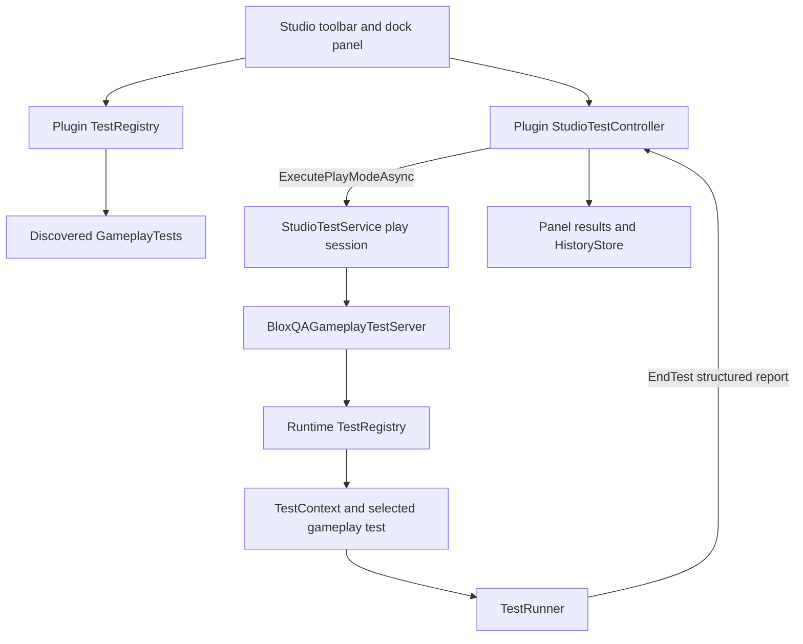

# BloxQA

Automated QA and gameplay testing for Roblox Studio.

> **Developer preview — v0.1.0.** BloxQA is an early local tool, not a published Creator Store plugin or production test platform.

## Overview

BloxQA is a Roblox Studio plugin and per-place test runtime for repeatable gameplay checks. It discovers valid test modules, launches isolated Studio play-mode sessions, executes tests through a server harness, and returns structured PASS/FAIL results to a dockable panel.

The project was built iteratively as a personal QA automation project using AI-assisted development workflows. Its focus is practical testing, debugging, plugin APIs, defensive error handling, and keeping test definitions separate from the user interface.

## Why BloxQA exists

Gameplay checks such as “did the player spawn correctly?” are easy to repeat manually and easy to forget. BloxQA turns those checks into small Luau modules that can be rerun from Studio while keeping failures, durations, discovery warnings, and recent results visible to the developer.

## Implemented features

- Roblox Studio toolbar button and `DockWidgetPluginGui` panel
- Individual test execution and sequential “Run All visible tests”
- Dynamic discovery of direct-child ModuleScripts whose names end in `Test`
- Required metadata validation and duplicate-ID diagnostics
- Dynamic category filters; filtered runs execute only visible tests
- Studio play-mode execution through `StudioTestService`
- Server-side harness and structured PASS/FAIL reports with durations and errors
- Minimal `TestContext` helpers for waiting, assertions, failure messages, logging, and player lookup
- Plugin-side watchdogs and malformed-result/runtime error handling
- Bounded history of 20 results using plugin settings; the panel shows the five newest entries
- Semantic version module and local release builder
- Self-contained global plugin startup with clear diagnostics when a place runtime is absent

## How it works



The installed plugin contains everything required to start its UI globally. Actual gameplay execution is intentionally per-place: the tested place must contain the BloxQA runtime, tests, and server harness.

See [Architecture](docs/architecture.md) for component responsibilities and failure handling.

## Example test

This is the real authoring template shipped with the project:

```luau
return {
    id = "MyTest",
    name = "My Test",
    category = "Gameplay",
    description = "Describe what this verifies.",
    timeout = 10,

    run = function(ctx)
        ctx:log("Starting My Test")

        local player = ctx:getPlayer()
        ctx:expect(player ~= nil, "No Player joined before the timeout")

        -- Add assertions here.
        return true
    end,
}
```

Copy `examples/ExampleTestTemplate.luau` into the place's `ReplicatedStorage.BloxQA.GameplayTests` folder, rename it so the ModuleScript name ends in `Test`, and give it a unique ID. See [Development and testing](docs/development.md).

## Installation and usage

BloxQA currently uses a source-based local installation workflow:

1. Recreate the global plugin hierarchy from `src/plugin` in Studio and save its root Script using **Plugins → Save as Local Plugin**.
2. Add the contents of `src/runtime` and `src/tests/gameplay` to the place being tested.
3. Restart Studio, open the BloxQA panel, and confirm version `0.1.0` appears.
4. Run one discovered test, choose a category filter, or run all currently visible tests.

Exact instance mappings and replacement steps are in [Installation](docs/installation.md). A one-click packaged release is not included in this source export yet.

## Repository structure

```text
BloxQA/
├── README.md
├── LICENSE
├── CHANGELOG.md
├── .gitignore
├── src/
│   ├── plugin/              # Global Studio plugin and embedded modules
│   ├── runtime/             # Per-place runner, context, registry and harness
│   └── tests/gameplay/      # Verified spawn and respawn tests
├── examples/                # Discovery-safe authoring template
├── tools/                   # Studio-side local release builder
├── docs/
│   ├── installation.md
│   ├── architecture.md
│   ├── development.md
│   ├── github.md
│   └── screenshots.md
└── assets/screenshots/      # Repository images to capture in Studio
```

## Current status

Version `0.1.0` includes two gameplay tests:

- **Player Spawn Test** verifies that a player receives a live Character with a Humanoid and HumanoidRootPart.
- **Player Respawn Test** kills the initial Humanoid and verifies that a distinct, live Character appears.

Both tests were verified in the BloxQA development place. This repository does not claim CI, multiplayer, device simulation, input automation, cloud reporting, or Creator Store distribution.

## Limitations and roadmap

Current limitations:

- Studio-only; the server harness exits outside Studio.
- Gameplay tests run one at a time in separate play-mode sessions.
- The runtime and server harness must be installed in each tested place.
- Tests execute through the server harness; client input automation is not implemented.
- History is local to the installed plugin identity and limited to 20 lightweight entries.
- No automated command-line build or one-click public release artifact is included yet.

Reasonable next steps are a reproducible package/export workflow, automated Luau checks, a documented compatibility matrix, and additional non-input gameplay assertions.

## Development

The code intentionally keeps the plugin UI, discovery, execution controller, runner, and test definitions modular. Changes should preserve the structured report contract and verify both normal play and Studio test sessions.

See [Development and testing](docs/development.md) and [Screenshot checklist](docs/screenshots.md).

## License

BloxQA is available under the [MIT License](LICENSE).

