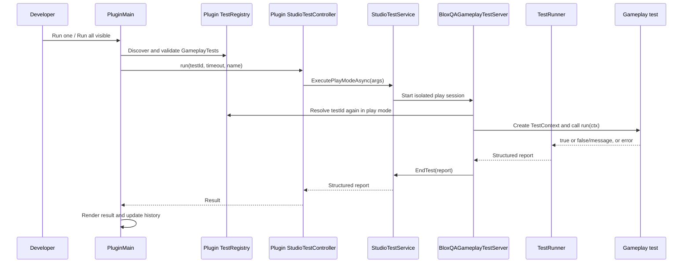

# Architecture

BloxQA is split into a global Studio plugin and a runtime installed in each place under test. This separation lets the toolbar and panel load in any place without pretending that gameplay tests can run where the runtime is absent.

## Execution flow



## Global plugin

`src/plugin/BloxQAPlugin.server.luau` is the executable plugin root. It receives Roblox's global `plugin` object and starts `PluginMain` inside `pcall`.

`PluginMain` creates the toolbar, button, and dock widget. It discovers tests from the current place, renders category filters and diagnostics, runs tests sequentially, normalizes reports, and catches unexpected errors. It does not duplicate play-session execution logic.

The plugin embeds its own copies of:

- `Version` for display and release identity.
- `TestRegistry` for safe edit-time discovery.
- `StudioTestController` for the `StudioTestService` boundary.
- `HistoryStore` for bounded plugin-setting persistence.
- `ProjectInitializer` for project-state inspection, idempotent setup, and conservative repair.
- `RuntimeTemplate` for the self-contained per-place runtime and starter-test sources.

If the current place has no BloxQA runtime, the toolbar and panel show onboarding instead of run controls. Initialization materializes only the embedded BloxQA runtime under `ReplicatedStorage.BloxQA` and `ServerScriptService.BloxQAGameplayTestServer`. Every created object is marked with `BloxQAOwned`, `BloxQASchemaVersion`, and `BloxQARuntimeVersion` attributes. Unowned or incompatible objects are diagnosed and never silently replaced.

## Per-place runtime

`TestRegistry` scans only direct children of `ReplicatedStorage.BloxQA.GameplayTests` whose ModuleScript names end in `Test`. It validates metadata, catches module load failures, rejects duplicate IDs, and sorts valid definitions by category, name, then ID. Invalid tests do not prevent valid tests from running.

`StudioTestController` starts a play session with protocol name `BloxQA`, protocol version `1`, the selected test ID, and a timeout value.

`BloxQAGameplayTestServer` runs only in Studio. It validates the protocol, discovers the selected definition again in play mode, creates `TestContext`, delegates execution to `TestRunner`, and ends the Studio test with a structured report.

`TestRunner` executes the supplied tests sequentially under `pcall`, measures elapsed time with `os.clock`, and returns totals plus result records.

## Result contract

The runner returns:

```luau
{
    total = number,
    passed = number,
    failed = number,
    results = {
        {
            name = string,
            status = "PASS" or "FAIL",
            passed = boolean,
            errorMessage = string?,
            durationMs = number,
        },
    },
}
```

The plugin validates incoming reports before displaying them. Service errors, malformed reports, missing duration/pass fields, controller errors, and watchdog timeouts are converted into readable failed results.

## History

`HistoryStore` records the test ID, display name, PASS/FAIL status, duration, timestamp, and optional error. It keeps at most 20 entries and uses `Plugin:GetSetting`/`Plugin:SetSetting`. Persistence failures are caught; in-memory history remains usable for the current plugin session.

